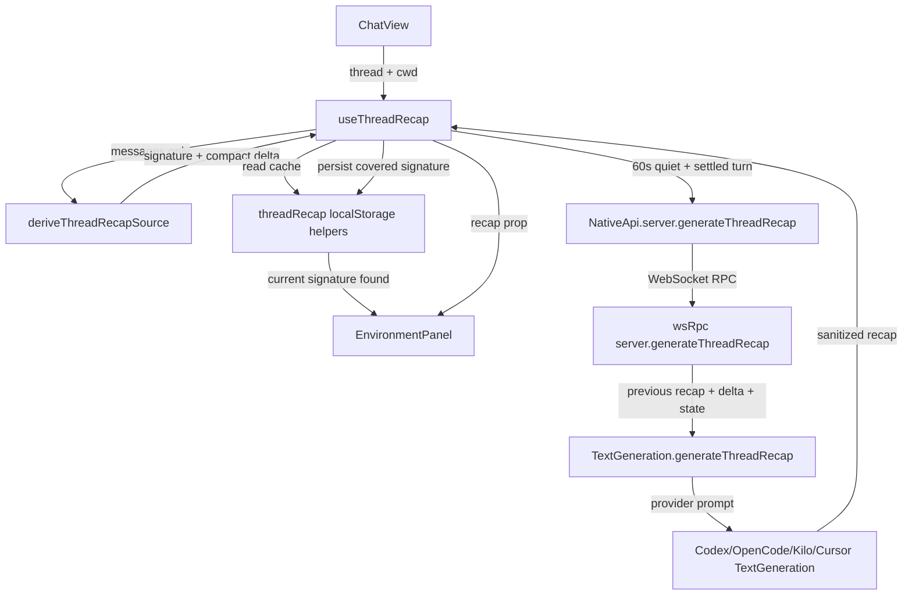
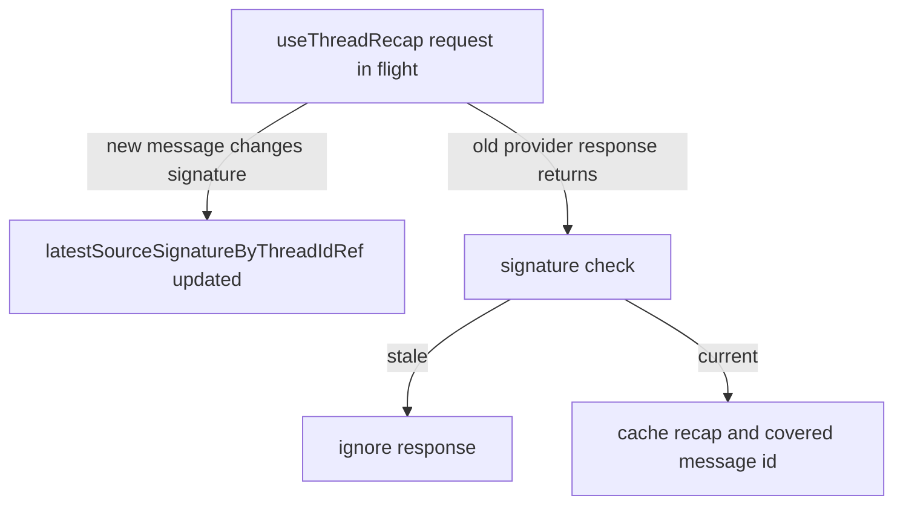

# Recap: Thread Recap Panel
> Generated: 2026-06-05  |  Scope: 20 files

---

## Summary

The goal was to add a compact, low-cost chat recap inside the new floating right Environment panel. The implementation adds a stateless server recap-generation RPC, shared provider-aware prompt plumbing, a client idle debounce hook, a bounded per-thread localStorage cache, and a small inline Recap row in the panel. The recap now updates only after real transcript messages settle, survives reloads for covered threads, and avoids repeat generation when the stored signature is still current.

---

## Files Affected

| File | Status | Role |
|---|---|---|
| `apps/web/src/hooks/useThreadRecap.ts` | ✅ Created | Idle debounce, persisted per-thread cache hydration, stale-response protection |
| `apps/web/src/lib/threadRecap.ts` | ✅ Created | Builds compact recap inputs and owns localStorage cache sanitization/pruning |
| `apps/web/src/lib/threadRecap.test.ts` | ✅ Created | Verifies message-only triggering, delta selection, and persisted-cache behavior |
| `apps/web/src/components/chat/environment/EnvironmentPanel.tsx` | ✏️ Modified | Renders compact inline Recap text with pending shimmer and 4-line clamp |
| `apps/web/src/components/ChatView.tsx` | ✏️ Modified | Wires `useThreadRecap` into Environment panel props |
| `apps/web/src/wsNativeApi.ts` | ✏️ Modified | Adds `server.generateThreadRecap` transport mapping |
| `packages/contracts/src/server.ts` | ✏️ Modified | Adds recap input/result schemas |
| `packages/contracts/src/ws.ts` | ✏️ Modified | Adds WebSocket method name and request schema |
| `packages/contracts/src/rpc.ts` | ✏️ Modified | Adds Effect RPC definition/group entry |
| `packages/contracts/src/ipc.ts` | ✏️ Modified | Adds NativeApi server method type |
| `apps/server/src/wsRpc.ts` | ✏️ Modified | Handles recap generation via `TextGeneration` |
| `apps/server/src/serverLayers.ts` | ✏️ Modified | Exposes `TextGenerationLayerLive` to WebSocket RPC |
| `apps/server/src/git/textGenerationShared.ts` | ✏️ Modified | Adds recap prompt builder and sanitizer |
| `apps/server/src/git/Services/TextGeneration.ts` | ✏️ Modified | Extends text-generation service with `generateThreadRecap` |
| `apps/server/src/git/Layers/ProviderTextGeneration.ts` | ✏️ Modified | Routes recap generation to the selected provider implementation |
| `apps/server/src/git/Layers/CodexTextGeneration.ts` | ✏️ Modified | Implements Codex recap generation |
| `apps/server/src/git/Layers/OpenCodeTextGeneration.ts` | ✏️ Modified | Implements OpenCode/Kilo recap generation |
| `apps/server/src/git/Layers/CursorTextGeneration.ts` | ✏️ Modified | Implements Cursor recap generation |
| `apps/server/src/git/Layers/ProviderTextGeneration.test.ts` | ✏️ Modified | Updates service double for the new method |
| `apps/server/src/git/Layers/GitManager.test.ts` | ✏️ Modified | Updates fake text-generation shape |

---

## Logic Explanation

### Problem

The panel needed a short memory note for the current chat without creating a second transcript, hammering the provider, or coupling recap updates to tool rows. The recap also needed to fit a narrow UI area, so the model output has to be short, plain, and prefix-free.

### Approach

The server endpoint is stateless: it receives a previous recap, new compact material, and current state, then returns one sanitized recap string. The client owns all throttling and cache policy, because it has the best view of transcript quietness and can avoid touching server projection or SQLite migrations.

### Step-by-step

1. `deriveThreadRecapSource` filters to real user/assistant messages, selects either the first compact window or the delta after the last covered message, and builds a stable signature from the latest real message.
2. `useThreadRecap` waits 60 seconds after the latest settled message signature, skips active assistant streaming/running turns, and ignores stale provider responses if a newer message arrives.
3. `server.generateThreadRecap` forwards the compact input to the shared `TextGeneration` service using the configured text-generation model selection when the client does not override it.
4. Provider implementations share `buildThreadRecapPrompt`, which asks for a JSON object with only `recap`, max 220 characters, no markdown, and no `recap:` prefix.
5. A successful recap is saved under `synara:thread-recaps:v1` with its covered message id, source signature, and update time. The cache is sanitized on read and pruned to the freshest 80 threads so localStorage stays bounded.
6. `EnvironmentPanel` displays the result as compact inline `Recap · text`, clamps text to four lines, and only shows pending shimmer while the first recap is being generated.

### Tradeoffs & Edge Cases

The recap cache is client-side localStorage for now, so it survives reloads in the same browser but is not shared across devices or browser profiles. This avoids schema migrations and keeps the projection hot path untouched; server-side persistence can be added later if recap sharing becomes product-critical. Tool/activity rows do not trigger generation, but their latest summaries can still be included as context when a real message does trigger a recap. In-flight responses are checked against the latest message signature so an old recap cannot mark newer messages as covered.

---

## Flow Diagram

### Happy Path

### Stale Response Path

---

## High School Explanation

Think of the recap like the sticky note you keep beside a long group project chat. It does not copy the whole chat. It only writes the newest important thing after everyone stops talking for a bit.

The app watches the real chat messages, not every behind-the-scenes action. When a new message is finished and the chat is quiet for one minute, it asks the writing model to update the sticky note. It sends the old sticky note plus just the new useful messages, so it does not waste a giant amount of text.

Now the app also puts that sticky note in a small drawer for that chat. If you reload the app and open the same chat, it checks the drawer first. If the note is already caught up, it shows it right away and does not ask the model again.

If a newer message arrives while the model is still writing the old sticky note, the app throws that old answer away. That keeps the note from saying it is caught up when it actually missed something.
